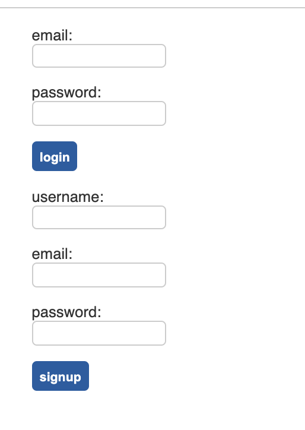
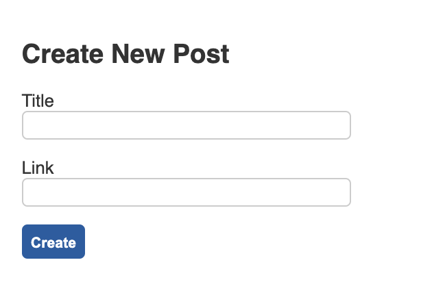
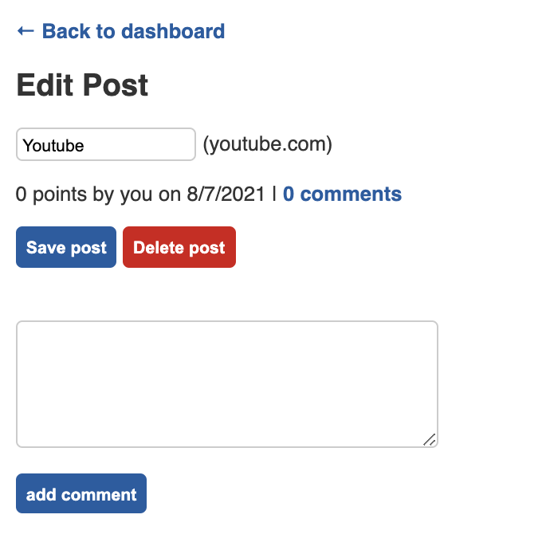

# just-tech-news

Fullstack blog app where users can sign in, create posts, edit posts, comment on posts, and delete posts.

## Create Account



## Create Post



## Edit Post



|                                         |                                         |                                                   |
| :-------------------------------------: | :-------------------------------------: | :-----------------------------------------------: |
|     [Introduction](#just-tech-news)     | [Table of Contents](#table-of-contents) | [Development Highlights](#development-highlights) |
|      [Installation](#installation)      |             [Tests](#tests)             |       [Code Hightlights](#code-highlights)        |
| [Technologies Used](#Technologies-Used) |           [Credits](#Credits)           |                [License](#License)                |

## Development Highlight

- Incorporate Handlebars.js as a template engine for the front end.
- Implment built-in and custom helpers in Handlebars.js
- Define relations in database between models
- Create middleware functions for login.

## Installation

1. Create .env file with this content to configure MySQL to your computer:

```
DB_NAME=ecommerce_db
DB_USER=<YOUR_MYSQL_USERNAME>
DB_PW=<YOUR_MYSQL_USERNAME>
```

2. Install node modules

```
npm i
```

3. Source Schema

- Login to MySQL shell: `mysql -u <username> -p
- Run `source db/schema.sql

4. Start app.

```
npm start
```

Makes request using Port 3002.

## Tests

```
npm test
```

## Code Highlights

## Technologies

### Backend Language

- [Node.js](https://nodejs.org/en/)

### Backend Framework

- [Express.js](https://expressjs.com/)

### Database

- [MySQL](https://www.mysql.com/)

### ORM

- [Sequelize](https://sequelize.org/)

### Template Engine

- [handlebarsjs](https://handlebarsjs.com/)

### User Accounts Dependencies

- [connect-session-sequelize](https://www.npmjs.com/package/connect-session-sequelize)
- [bctrypt](https://www.npmjs.com/package/bcrypt)

## Credits

|                           |                                                                                                                                                                                                       |
| ------------------------- | ----------------------------------------------------------------------------------------------------------------------------------------------------------------------------------------------------- |
| **David Anusontarangkul** | [ LinkedIn](https://www.linkedin.com/in/anusontarangkul/) [ GitHub](https://github.com/anusontarangkul) |

## License

[](https://opensource.org/licenses/MIT)
